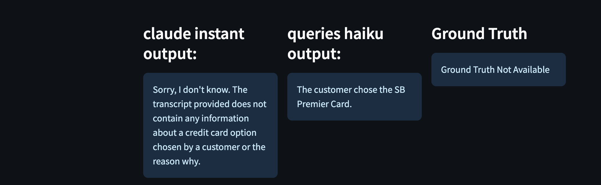

# Human In the Loop Demo

## Overview
Streamlit is used to display the human in the loop demo (to efficiently evaluate LLM responses using human experts). 

This streamlit demo is a comprehensive framework that encompasses a wide variety of processes including running automatic LLM generations and testing new instructions. This aims to improve the current Call Metadata generation solution so that it can produce accurate, contextually relevant, and safe outputs. The demonstration will play a crucial role in deploying improved LLM solutions effectively, addressing challenges related to bias, misinformation, and unintended outputs. This module implements a tool to enable the evaluation of LLMs by humans using a double-blind evaluation. It displays the different versions of outputs so that a human can compare quality of the outputs. 

**Important: Run a SageMaker Studio Instance**

### Environment Settings
In order to run the different modules, we used following environment and settings.

```
RAM: 5GB memory 
SageMaker Instance: ml.t3.large
```
Run on a sagemaker domain and create a JupyterLab instance. 

## Setup and Install  
  
1. Clone the repository:  

2. Install dependencies using the [requirements.txt](./requirements.txt):
```
pip install -r requirements.txt
```

## Getting Started  

### HITL Demo
1. Make sure you have the requisite data available. At a minimum, the following datasets with the exact names in the data/ folder should be available:
```
nl_queries_{model_name}.csv: this is the question and answering dataset with a specific question, context, answer, and prompt. The model name refers to any of the elements in the 'model_used' variable in the [config file](./config.py), and this is the model used that answered the questions. For the best results, include two of these datasets, one for each different model_name.

{any_name}_{model_name}.csv: this is the summarization dataset with a context, summary, and prompt. The model name refers to any of the elements in the 'model_used' variable in the [config file](./config.py), and this is the model used that summarized the context. For the best results, include two of these datasets, one for each different model_name.
```
An example of the files required are shown in the [data](./data/) folder. 

2. Below is a description of the columns in each of the datasets listed below:
```
nl_queries_{model_name}.csv:
    question(str): A sample question asked to the LLM ({model_name} type)
    context(str): The context that is referred to answer the question. This can be a document, call transcript (as it is for the example), or anything else
    prompt(str): The exact instruction that is sent to the {model_name} LLM
    Answers(str): The LLM response to the question for the specific context

{any_name}_{model_name}.csv
    context(str): The context that is referred to get the summary. This can be a document, call transcript (as it is for the example), or anything else
    prompt(str): The exact instruction that is sent to the {model_name} LLM
    summary(str): The LLM response to the summary for the specific context
```
Look closely at nl_queries_claude_instant.csv, nl_queries_haiku.csv, summary_claude_instant.csv, summary_claude_haiku.csv for exact formats of the data. 

3. For running the prompt human evaluation Streamlit app, please use the command:
```
streamlit run prompt_human_evaluation_app.py --server.runOnSave true
```
Then, you'll see the information in the terminal:
```
  You can now view your Streamlit app in your browser.

  Network URL: http://169.255.254.1:8501
  External URL: http://35.174.73.137:8501
```
Because of the restriction in SageMaker Studio, click the link doesn't open the app automatically. To address this issue, please copy the link of the terminal page and add **/proxy/port_number/** right after **/default/**. Copy and paste the link into a new tap and hit enter. The sample link:
```
https://{notebook-url}/jupyter_lab/default/proxy/8501/
```
In the link, add a field to analyze, and two metadata files to compare (these should be stored in the data folder). Then, select the following options for each evaluation metric and when everything is finished running, statistics for all the metrics should appear.

4. Input your field to analyze (summary or QnA), and the two datasets that you want to analyze.


5. Navigate from top to bottom to see the question, instructions, context, and the model generated output.




6. Lastly, give your feedback to the model outputs by giving a thumbs up or thumbs down, giving feedback on certain metrics, or giving text feedback. Then click 'save and next'. 


7. Keep going through the different examples and give your feedback. Once no new inputs come (all the fields are blank with the default phrases), then you have gone through the whole dataset. Press 'End and Show Scores'. All outputs are stored in a generated folder for the file in the data folder with quantitative outputs of the metrics (for Fluency, Relevancy, etc..) and any text comments. For example if you evaluated the nl_queries_claude_instant.csv and nl_queries_haiku.csv, two folders within the data folder should generate: nl_queries_claude_instant/ and nl_queries_haiku/ with the following csv outputs:
```
comments_output.csv - text comments given for specific questions
nl_queries_{model_used}_outputs.csv - quantitative values for metrics (fluency, relevancy, etc..)
```


### Make Changes
1. In [config.py](./config.py) you can change the metadata_prompt_qns variable based on your use case. Right now, metadata_prompts_qns includes a summarization task which allows the user to evaluate summarization tasks for the specific question. If you want to add more tasks, such as a root cause analysis task with the question, 'What is the Root Cause of the Issue', you can add it in the config file as follows:
```
metadata_prompt_qns = {
    "summary": "What is the summary of the transcript?",
    "root_cause": 'What is the Root Cause of the Issue'
}
```
Then go to all the csv files that DON'T start with nl_queries_.... For this example, that is summary_claude_instant.csv and summary_claude_haiku.csv. Make sure to add a 'root_cause' column with the 'root cause' generation from the LLM. 

2. In [config.py](./config.py) you can change the models_used variable based on the specific model that was used. For example, if you want to add finetuned titan model outputs, do the following:
```
# Change the variable
models_used = ["None", "claude_instant", "haiku", "finetuned_titan"] 
```
Then for all csv data files (in this example includes nl_queries_{model_used} and summary_{model_used} for all models used) include another copy of the file, for example nl_queries_finetuned_titan.csv and summary_finetuned_titan.csv, where the generated LLM response is that from a finetuned titan model. 

3. Go to prompt_human_evaluation_app.py for the main source code. Look at the comments within the code to see where each code snippet maps to the streamlit UI. 


## Security

See [CONTRIBUTING](CONTRIBUTING.md#security-issue-notifications) for more information.

## License

This library is licensed under the MIT-0 License. See the LICENSE file.

